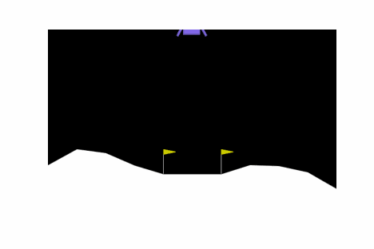

# rl-gymnasium-training

Working on my Reinforcement Learning skills using Gymnasium environments (https://gymnasium.farama.org/).

## Examples

Random Agent             |  Trained Agent
:-----------------------:|:-----------------------:
 | 
 | 
 | 
